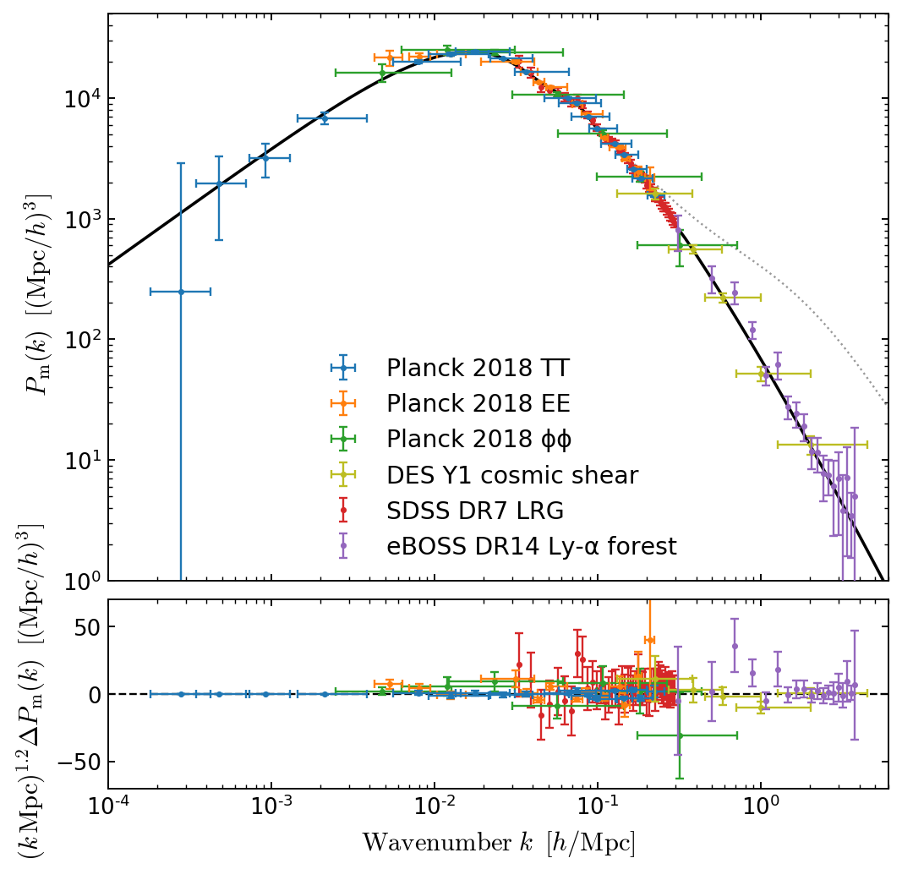

# Matter power spectrum compilation


In their [2002 paper](https://arxiv.org/abs/astro-ph/0207047), Max Tegmark and Mattias Zaldarriaga developed a method for compressing the information from several different types of cosmological probes into constraints on the power spectrum of matter fluctuations in the universe. In doing so, they created one of the iconic figures in cosmology, summarizing information from a range of vastly different observations and showing these were all consistent with the predicitions from the simple ΛCDM model of cosmology. 


We have updated this figure in [Chabanier et al. 2019](link-not-live-yet) and [Planck 2018: I](https://arxiv.org/abs/1807.06205) to include recent cosmological data, and provide this repository so others can contribute to keeping this compilation up-to-date. If you have some data points you have added, please don't hesitate to contact the authors and/or submit a pull request. 



## Usage

This repository comes in the form a [Jupyter](http://jupyter.org/) notebook packaged inside of a Docker container, so that you don't need to manually install the (fairly complex) set of dependencies needed for this calculation. You can preview this notebook without running it [here](https://nbviewer.jupyter.org/github/marius311/mpk_compilation/blob/master/notebooks/mpk_compilation.ipynb).

You can also easily run this notebook (no need to clone this repository) by [installing Docker](https://docs.docker.com/install/) then running:

```bash
PORT=8888; docker run --rm -e PORT=$PORT -itp $PORT:$PORT marius311/mpk_compilation
```

You will be prompted with a link to open the notebook in your browser. You can change the port from 8888 if you wish. 

If using **Docker for Windows/Mac**, the default Docker memory limit of 2GB is not enough for the notebook to run, see instructions for [Windows](https://docs.docker.com/docker-for-windows/#resources) and [Mac](https://docs.docker.com/docker-for-mac/#resources) on how to increase it. 

Once you've run the notebook, if you want to download the figure in PDF format, return to the Jupyter notebook file screen (click the Jupyter logo), select the PDF file, and click download. 

If you wish to develop this repository or to have changes to the notebook saved between sessions, you can clone this repository and run locally via:

```bash
git clone https://github.com/marius311/mpk_compilation
cd mpk_compilation
docker-compose pull # or replace "pull" with "build" to build the image locally
PORT=8888 docker-compose up
```

This mounts the local `mpk_compilation/notebooks` folder into the container so that if you modify the notebook, changes are saved to your local filesystem, and files can more easily be copied in or out of the container.

## Citing

Please cite [Chabanier et al. 2019](https://arxiv.org/abs/1905.08103) and [Planck 2018: I](https://arxiv.org/abs/1807.06205) if you make use of this figure or code.
